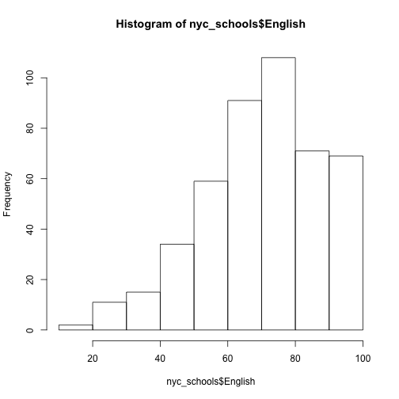
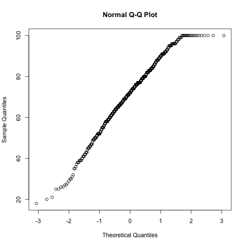
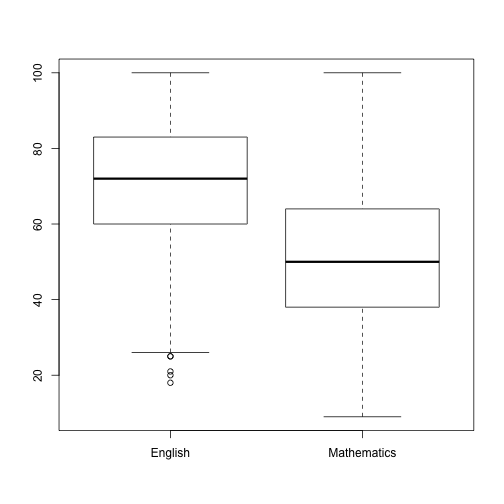
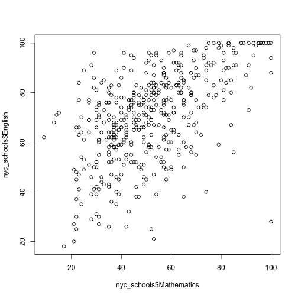
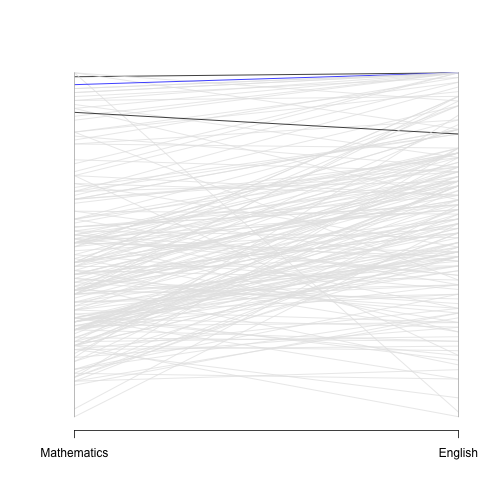
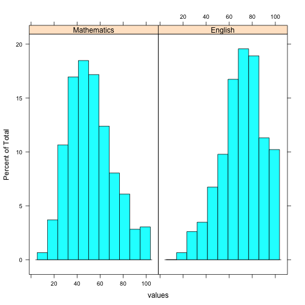
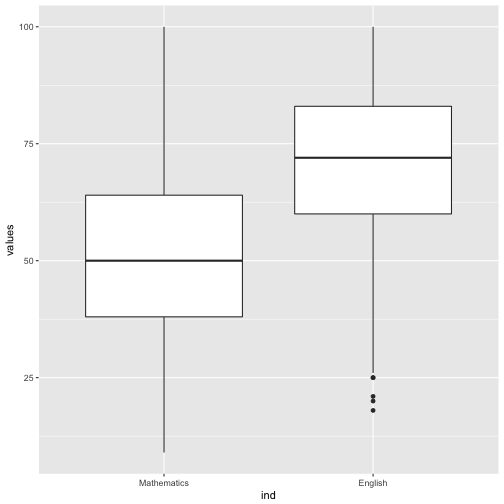

What Is R
========================================================
author: John Verzani, CUNY/College of Staten Island
date: April 16, 2018
autosize: true


Self described
========================================================

> R is ‘GNU S’, a freely available language and environment for statistical computing and graphics which provides a wide variety of statistical and graphical techniques: linear and nonlinear modelling, statistical tests, time series analysis, classification, clustering, etc.

https://cran.r-project.org/


History of R 
========================================================


| Year|Occurence                                         |
|----:|:-------------------------------------------------|
| 1976|S created (Old S) at Bell Laboratories            |
| 1988|New S created (S3; model specification notation)  |
| 1988|S-PLUS formed                                     |
| 1993|S-Plus acquires exclusive license to distribute S |
| 1995|initial version of R released                     |
| 1998|S4                                                |
| 2000|R 1.0.0 released                                  |
| 2003|R Foundation founded                              |
| 2004|R 2.0.0 released                                  |
| 2007|Revolution Analytics was founded                  |
| 2011|Initial release of R Studio                       |
| 2012|R Shiny on CRAN                                   |
| 2015|R Consortium founded                              |
| 2015|Revolution acquired by Microsoft                  |


Users of R
========================================================

* Estimates of R users are at least 2-3 million.

* Many add on packages (currently 12,444)


Sources of additional information
========================================================

* There is a (partial) list of [books about R](https://www.r-project.org/doc/bib/R-books.html) (only 162)

* Many packages are described in [The R Journal](https://journal.r-project.org/).

* Bloggers are aggregated at [r-bloggers](https://www.r-bloggers.com/).

* There are [mailing lists](https://www.r-project.org/mail.html).


Some basic features
========================================================

Let's go over some common tasks in R that might be done in an introductory statistics course.
While there are some GUIs for R to facilitate some of this, the strength of R comes from
its programming interface, so lets stick to that.


Some basic: vectors, functions, and data frames
========================================================

Univariate data is stored in "vectors" -- 1-dimensional arrays of elements of the same class. Missing values are coded with `NA`:


```r
name = c("Cooper", "Glashow", "Weinberg", "Schwartz","Hulse", "Politzer", "Glauber", "Lefkowitz")
year = c(47, 50, 50, 49, 66,66,41,59)
awarded = c(1972, 1979, 1979, 1988, 1993, 2004, 2005, 2012)
fields = c(rep("Physics", length(year)-1), "Chemistry")
fields  # view last one defined
```

```
[1] "Physics"   "Physics"   "Physics"   "Physics"   "Physics"   "Physics"  
[7] "Physics"   "Chemistry"
```

Functions
========================================================

Functions are called using parentheses, as above where `c(...)` is used to combine its arguments.

Functions in R are typically "vectorized" to work with all values as whole:


```r
min(year)   # reduction
```

```
[1] 41
```

```r
max(year)
```

```
[1] 66
```

```r
toupper(fields)  # f([x1,...,xn]) = [f(x1),...,f(xn)]
```

```
[1] "PHYSICS"   "PHYSICS"   "PHYSICS"   "PHYSICS"   "PHYSICS"   "PHYSICS"  
[7] "PHYSICS"   "CHEMISTRY"
```

Data frames
========================================================

Multivariate data is usually combined in a "data frame" -- each row records values or different variables of a "case", each column records all values for a variable:


```r
nobels = data.frame(name=name, year=year, 
                    awarded=awarded, fields=fields)
nobels
```

```
       name year awarded    fields
1    Cooper   47    1972   Physics
2   Glashow   50    1979   Physics
3  Weinberg   50    1979   Physics
4  Schwartz   49    1988   Physics
5     Hulse   66    1993   Physics
6  Politzer   66    2004   Physics
7   Glauber   41    2005   Physics
8 Lefkowitz   59    2012 Chemistry
```

Access
========================================================

Variables in data frames may be accessed in many ways. Here is one way to call them by name:


```r
table(nobels$year)     # data_frame_name$variable_name
```

```

41 47 49 50 59 66 
 1  1  1  2  1  2 
```

As data frames are rectangular, there is (matrix) syntax to call them by row and column


```r
nobels[1, c(1,2)]  # first row; first & second cols
```

```
    name year
1 Cooper   47
```

(`[` is for indexing objects by number, name, or logical vectors;  `$` is special syntax for accessing a variable by name from within some objects, such as data frames.)

Real data
========================================================

A brief indulgence, R can be used to webscrape data. This grabs data from a US News and world report page about Bronx Science. It is the data used to make a graphic about percentage of the grade that test at the grade level or higher:


```r
library(httr); library(rvest); library(rjson)
url = "http://www.usnews.com/education/best-high-schools/new-york/districts/new-york-city-public-schools/bronx-high-school-of-science-13207"
UA = "Mozilla/5.0 (Linux; <Android Version>; <Build Tag etc.>) AppleWebKit/<WebKit Rev> (KHTML, like Gecko) Chrome/<Chrome Rev> Mobile Safari/<WebKit Rev>"

out = httr::GET(url, user_agent(UA))  # must trick us news
```

continued... process data
============================================================


```r
u = read_html(out) %>% 
  xml_nodes(xpath='//*[@type="chart-json"]')
u = u[[3]] %>% html_text() %>% 
  fromJSON        # process data for graphic

row1 = as.data.frame(u[[1]], stringsAsFactors=FALSE)
nyc_schools = Reduce(rbind, u[-1], row1) # combine rows
kable(head(nyc_schools))   # first 6/460
```


| Mathematics|Name                                          | English|
|-----------:|:---------------------------------------------|-------:|
|          25|Bronx Preparatory Charter School              |      53|
|          82|John V Lindsay Wildcat Academy Charter School |      84|
|          56|Renaissance Charter School (The)              |      84|
|          92|Lower East Side Preparatory High School       |      82|
|          51|Marta Valle High School                       |      74|
|          68|Cascades High School                          |      80|

Summary Statistics
========================================================

R has a full set of summary statistics built in:


```r
mean(nyc_schools$Mathematics)
```

```
[1] 52.08696
```

```r
median(nyc_schools$Mathematics)
```

```
[1] 50
```

```r
sd(nyc_schools$Mathematics)
```

```
[1] 18.79024
```

```r
IQR(nyc_schools$Mathematics)
```

```
[1] 26
```

continued ....
==========================================


```r
summary(nyc_schools$Mathematics)
```

```
   Min. 1st Qu.  Median    Mean 3rd Qu.    Max. 
   9.00   38.00   50.00   52.09   64.00  100.00 
```

```r
quantile(nyc_schools$Mathematics, probs=seq(0,1,by=.1))
```

```
   0%   10%   20%   30%   40%   50%   60%   70%   80%   90%  100% 
  9.0  30.0  36.0  40.0  45.0  50.0  55.0  60.0  67.2  80.0 100.0 
```


```r
gp = function(x) cut(x, 20*(0:5), include.lowest = TRUE)
xtabs(~gp(Mathematics) + gp(English), nyc_schools)
```

```
               gp(English)
gp(Mathematics) [0,20] (20,40] (40,60] (60,80] (80,100]
       [0,20]        1       0       0       4        0
       (20,40]       1      16      43      61       14
       (40,60]       0       7      40      97       40
       (60,80]       0       2       9      33       47
       (80,100]      0       1       1       4       39
```

continued.....
========================================================


```r
stem(nyc_schools$English)
```

```

  The decimal point is 1 digit(s) to the right of the |

   1 | 8
   2 | 01
   2 | 55667789
   3 | 0012
   3 | 55678889999
   4 | 001112223334
   4 | 555566667777899999
   5 | 00000011112222222223333444
   5 | 55555556666777788888888889999999
   6 | 000000011111112222222233333333444444444
   6 | 555555555566666666666777777777788888888999999999999
   7 | 00000000111111111111222222222233333333444444444444
   7 | 555555556666666666667777777777777777788888889999999999
   8 | 00000000000011111222222222233333333333444444444
   8 | 555555666667777788888888999999
   9 | 0000001111111112222223333444
   9 | 55555556666666667778889999
  10 | 000000000000000000000
```

Statistical Graphics
========================================================

R has at least 3 main mechanisms for producing graphics:

* base graphics (look a bit dated now, but quite robust and straightforward)
* lattice graphics (adopted from S-Plus in early 2000s, multivariate displays)
* ggplot2 graphics (attention to look of graphics, abstractions employed. Appear in the NY Times and elsewhere)

Histogram
========================================================

A histogram of a data set: How did English scores do


```r
hist(nyc_schools$English)
```




A quantile plot
========================================================


```r
qqnorm(nyc_schools$English)
```



A boxplot to compare both scores
========================================================


```r
out = subset(nyc_schools, select=c("English", "Mathematics"))
boxplot(out)
```



The scatter plot
========================================================


```r
plot(nyc_schools$Mathematics, nyc_schools$English)
```




A parallel coordinates plot
========================================================


```r
peers = c(30, 177)
you = c(128)
nyc_schools$color = "gray90"
nyc_schools$color[peers] = "black"
nyc_schools$color[you] = "blue"
library(MASS)
parcoord(nyc_schools[1:200 ,c(1,3)], col=nyc_schools$color)
```




Other R graphics engines
=====================================

These work best with "stacked" data, where additional variables store various categories. Here we reshape the data into a two columns, one storing a test score, the other the test type


```r
nyc_stacked = stack(nyc_schools, c("Mathematics", "English"))
head(nyc_stacked) 
```

```
  values         ind
1     25 Mathematics
2     82 Mathematics
3     56 Mathematics
4     92 Mathematics
5     51 Mathematics
6     68 Mathematics
```

Lattice graphics
=====================================================


```r
library(lattice)
histogram(~ values | ind, nyc_stacked)
```



ggplot2
====================================


```r
library(ggplot2)
ggplot(nyc_stacked, aes(x=ind, y=values)) + geom_boxplot()
```



Probability distributions
========================================================

R has many probability distributions built in or available through add-on packages.


```r
rbinom(10, 5, 1/2)  # 5 coins tossed 10 times. Counts number of heads
```

```
 [1] 0 1 3 4 3 1 3 5 2 3
```

```r
dbinom(4, 5, 1/2)   # probability 5 coin tosses give 4 heads
```

```
[1] 0.15625
```

```r
choose(5,4) * (1/2)^4 * (1/2)^1
```

```
[1] 0.15625
```

Left tails
======================================================

```r
pbinom(1, 5, 1/2)   # probability of 0 or 1 heads in 5 coin tosses
```

```
[1] 0.1875
```

```r
mu = 5*1/2; sigma=sqrt(5*1/2*(1 - 1/2))  # mu = np; sigmq = sqrt(n*p*(1-p))
pnorm(1, mu, sigma) # normal approximation
```

```
[1] 0.08985625
```

```r
pnorm(1+1/2, mu, sigma) # with correction
```

```
[1] 0.1855467
```


Statistical Inference
========================================================

Suppose, you had independent samples, would you think the English and Math Scores have the same mean?

A test of $\mu_e = \mu_m$ would be done with


```r
t.test(nyc_schools$Mathematics, nyc_schools$English, var.equal=FALSE)
```

```

	Welch Two Sample t-test

data:  nyc_schools$Mathematics and nyc_schools$English
t = -15.518, df = 915.34, p-value < 2.2e-16
alternative hypothesis: true difference in means is not equal to 0
95 percent confidence interval:
 -21.09680 -16.35973
sample estimates:
mean of x mean of y 
 52.08696  70.81522 
```

Paired test
========================================================

But these scores aren't independent. A paired test seems more appropriate (a test of $y_i = e_i - m_i$ had $\mu = 0$):


```r
t.test(nyc_schools$Mathematics, nyc_schools$English, paired=TRUE) 
```

```

	Paired t-test

data:  nyc_schools$Mathematics and nyc_schools$English
t = -23.197, df = 459, p-value < 2.2e-16
alternative hypothesis: true difference in means is not equal to 0
95 percent confidence interval:
 -20.31486 -17.14166
sample estimates:
mean of the differences 
              -18.72826 
```

Using the model interface
========================================================

R has a special interface to specify a statistical model. (We used it with `lattice`.)

Above we passed two vectors, here we use a "factor" (a categorical variable):


```r
t.test(values ~ ind, data=nyc_stacked, paired=TRUE)
```

```

	Paired t-test

data:  values by ind
t = -23.197, df = 459, p-value < 2.2e-16
alternative hypothesis: true difference in means is not equal to 0
95 percent confidence interval:
 -20.31486 -17.14166
sample estimates:
mean of the differences 
              -18.72826 
```

Linear models
========================================================

The model $y_i = \alpha + \beta x_i + e_i$ is fit similarly:


```r
res = lm(English ~ Mathematics, data=nyc_schools)
res
```

```

Call:
lm(formula = English ~ Mathematics, data = nyc_schools)

Coefficients:
(Intercept)  Mathematics  
    43.5124       0.5242  
```

ANOVA
=======================================================

ANOVA models are fit as linear models with categorical variables. The t-test (non paired) with an assumption of equal variance is equivalent to a basic one-way ANOVA. 


```r
res = lm(values ~ ind, nyc_stacked)  # ind is categorical
summary(res)
```

```

Call:
lm(formula = values ~ ind, data = nyc_stacked)

Residuals:
    Min      1Q  Median      3Q     Max 
-52.815 -12.815  -0.087  12.185  47.913 

Coefficients:
            Estimate Std. Error t value Pr(>|t|)    
(Intercept)  52.0870     0.8534   61.04   <2e-16 ***
indEnglish   18.7283     1.2069   15.52   <2e-16 ***
---
Signif. codes:  0 '***' 0.001 '**' 0.01 '*' 0.05 '.' 0.1 ' ' 1

Residual standard error: 18.3 on 918 degrees of freedom
Multiple R-squared:  0.2078,	Adjusted R-squared:  0.2069 
F-statistic: 240.8 on 1 and 918 DF,  p-value: < 2.2e-16
```

Data manipulations
========================================================

Example taken from [dplyr-tutorial](https://rpubs.com/justmarkham/dplyr-tutorial).

The `hflights` package contains a large data set on airline flights:


```r
library(hflights)
dim(hflights)  # 227,496 cases; 21 variables
```

```
[1] 227496     21
```

```r
names(hflights)
```

```
 [1] "Year"              "Month"             "DayofMonth"       
 [4] "DayOfWeek"         "DepTime"           "ArrTime"          
 [7] "UniqueCarrier"     "FlightNum"         "TailNum"          
[10] "ActualElapsedTime" "AirTime"           "ArrDelay"         
[13] "DepDelay"          "Origin"            "Dest"             
[16] "Distance"          "TaxiIn"            "TaxiOut"          
[19] "Cancelled"         "CancellationCode"  "Diverted"         
```

Using dplyr
=========================


```r
library(dplyr)  # data wrangling tool of choice
flights <- tbl_df(hflights)  # make a copy
flights
```

```
# A tibble: 227,496 x 21
    Year Month DayofMonth DayOfWeek DepTime ArrTime UniqueCarrier
 * <int> <int>      <int>     <int>   <int>   <int> <chr>        
 1  2011     1          1         6    1400    1500 AA           
 2  2011     1          2         7    1401    1501 AA           
 3  2011     1          3         1    1352    1502 AA           
 4  2011     1          4         2    1403    1513 AA           
 5  2011     1          5         3    1405    1507 AA           
 6  2011     1          6         4    1359    1503 AA           
 7  2011     1          7         5    1359    1509 AA           
 8  2011     1          8         6    1355    1454 AA           
 9  2011     1          9         7    1443    1554 AA           
10  2011     1         10         1    1443    1553 AA           
# ... with 227,486 more rows, and 14 more variables: FlightNum <int>,
#   TailNum <chr>, ActualElapsedTime <int>, AirTime <int>, ArrDelay <int>,
#   DepDelay <int>, Origin <chr>, Dest <chr>, Distance <int>,
#   TaxiIn <int>, TaxiOut <int>, Cancelled <int>, CancellationCode <chr>,
#   Diverted <int>
```


Let's ask some questions:
=====================================

* What flights left on Jan 1?
* Which of these were on American Airlines?
* Which airline had the most flights on Jan 1?
* What was the average flight length by airline?
* Which airline had largest variance in delay times?


What flights left on Jan 1?
=============================
January 1 is all cases with `Month=1` and `DayOfMonth=1`

```r
jan1 = filter(flights, Month==1, DayofMonth==1)
head(jan1, n=5)
```

```
# A tibble: 5 x 21
   Year Month DayofMonth DayOfWeek DepTime ArrTime UniqueCarrier FlightNum
  <int> <int>      <int>     <int>   <int>   <int> <chr>             <int>
1  2011     1          1         6    1400    1500 AA                  428
2  2011     1          1         6     728     840 AA                  460
3  2011     1          1         6    1631    1736 AA                 1121
4  2011     1          1         6    1756    2112 AA                 1294
5  2011     1          1         6    1012    1347 AA                 1700
# ... with 13 more variables: TailNum <chr>, ActualElapsedTime <int>,
#   AirTime <int>, ArrDelay <int>, DepDelay <int>, Origin <chr>,
#   Dest <chr>, Distance <int>, TaxiIn <int>, TaxiOut <int>,
#   Cancelled <int>, CancellationCode <chr>, Diverted <int>
```


Which of these were on American Airlines?
===========================================


```r
xtabs( ~ UniqueCarrier, jan1)  # 7 are American (AA)
```

```
UniqueCarrier
 AA  AS  B6  CO  DL  EV  F9  FL  MQ  OO  UA  US  WN  XE 
  7   1   2 192   4   5   3   4   9   5   6  10  82 222 
```

```r
filter(jan1, UniqueCarrier == "AA")
```

```
# A tibble: 7 x 21
   Year Month DayofMonth DayOfWeek DepTime ArrTime UniqueCarrier FlightNum
  <int> <int>      <int>     <int>   <int>   <int> <chr>             <int>
1  2011     1          1         6    1400    1500 AA                  428
2  2011     1          1         6     728     840 AA                  460
3  2011     1          1         6    1631    1736 AA                 1121
4  2011     1          1         6    1756    2112 AA                 1294
5  2011     1          1         6    1012    1347 AA                 1700
6  2011     1          1         6    1211    1325 AA                 1820
7  2011     1          1         6     557     906 AA                 1994
# ... with 13 more variables: TailNum <chr>, ActualElapsedTime <int>,
#   AirTime <int>, ArrDelay <int>, DepDelay <int>, Origin <chr>,
#   Dest <chr>, Distance <int>, TaxiIn <int>, TaxiOut <int>,
#   Cancelled <int>, CancellationCode <chr>, Diverted <int>
```

Which airline had the most flights on Jan 1?
============================================

We can see `XE` had the most, 222. As an alternative to cross tabulation, we can do a group-by operation using 


```r
group_by(jan1, UniqueCarrier) %>%
  summarize(size=n()) %>%
  arrange(desc(size))  # sort in descending order
```

```
# A tibble: 14 x 2
   UniqueCarrier  size
   <chr>         <int>
 1 XE              222
 2 CO              192
 3 WN               82
 4 US               10
 5 MQ                9
 6 AA                7
 7 UA                6
 8 EV                5
 9 OO                5
10 DL                4
11 FL                4
12 F9                3
13 B6                2
14 AS                1
```

The `n` function counts cases. We can use other functions here.

What was the average flight length by airline?
===============================================
For example, the `AirTime` variable records time in air. The average of this *after* grouping by carrier is found with:


```r
group_by(jan1, UniqueCarrier) %>% summarize(avg=mean(AirTime,na.rm=TRUE)) %>%
  arrange(desc(avg)) %>% head(n=3)
```

```
# A tibble: 3 x 2
  UniqueCarrier   avg
  <chr>         <dbl>
1 AS             255.
2 B6             184.
3 OO             154.
```

We can see `AS` was longest.

Which airline had largest variance in delay times?
==================================================

If we instead use the `DepDelay` variable, we have


```r
group_by(jan1, UniqueCarrier) %>% summarize(avg=mean(DepDelay,na.rm=TRUE), sd=sd(DepDelay, na.rm=TRUE)) %>% arrange(desc(sd)) %>% head(n=3)
```

```
# A tibble: 3 x 3
  UniqueCarrier   avg    sd
  <chr>         <dbl> <dbl>
1 B6             24.0  42.4
2 EV             21.4  39.2
3 DL             15.8  36.9
```

(Why is `AS` -- the longest on average, `NA` here?)


More details
========================================================


```r
summary(res)
```

```

Call:
lm(formula = values ~ ind, data = nyc_stacked)

Residuals:
    Min      1Q  Median      3Q     Max 
-52.815 -12.815  -0.087  12.185  47.913 

Coefficients:
            Estimate Std. Error t value Pr(>|t|)    
(Intercept)  52.0870     0.8534   61.04   <2e-16 ***
indEnglish   18.7283     1.2069   15.52   <2e-16 ***
---
Signif. codes:  0 '***' 0.001 '**' 0.01 '*' 0.05 '.' 0.1 ' ' 1

Residual standard error: 18.3 on 918 degrees of freedom
Multiple R-squared:  0.2078,	Adjusted R-squared:  0.2069 
F-statistic: 240.8 on 1 and 918 DF,  p-value: < 2.2e-16
```


As a programming language
========================================================

* R is a dynamic scripting (interpreted) language

* R is vectorized

* Easy to define functions


```r
kurtosis = function(x, ctr=mean(x)) {
  zi = (x-ctr)/(sd(x) * sqrt((n-1)/n))
  1/length(x) * sum(zi^4) - 3
}
```

* functions are first class objects

* has object-oriented features through "generic" functions 

```
summary(nyc_schools$English)
summary(nyc_schools$English)
```

(several OOP style implementations)

* Has built in support for mathematical programming (functions, arrays)


Teaching (statistics) with R
========================================================

Pros:

* designed for interactive statistical explorations
* Designed with great attention to numeric issues
* most graphics, functions are built in
* Can be used with real-world data or built in data
* easy to extend, if need be, by user-defined functions or user-contributed packages
* non-programmers can pick up some CS concepts
* can easily grow as student interests evolve
* valued in industry
* R Studio is a great IDE for beginners and more advanced users
* R Studio makes writing richly styled reports quite easy
* R Studio's Shiny package can make it easy to write R-powered interactive web pages
* R is open source
continued ...
========================================================

Cons:

* programming languages are hard to pick up at first. R is easier than Python, but still not easy
* time is spent on specifics of data manipulation, even if not desirable
* time for learning about statistics is spent on computer science-like concepts
* hard to find online help, as there is *too* much. (The [mosaic](https://cran.r-project.org/web/packages/mosaic/index.html) package streamlines the experience for new users)
* hard to keep the entire class at the same point (as some students pick it up quite quickly)
